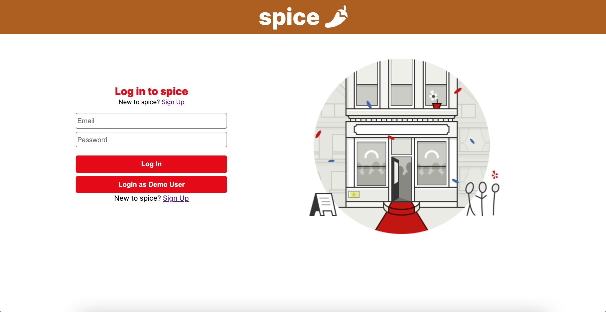
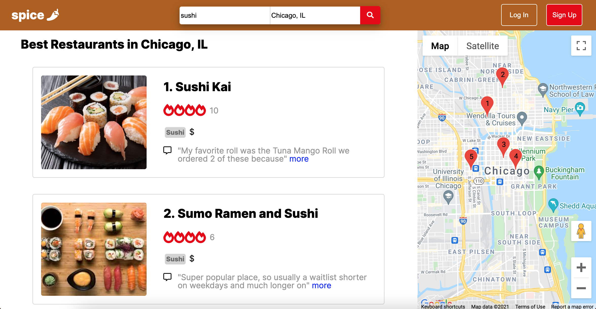
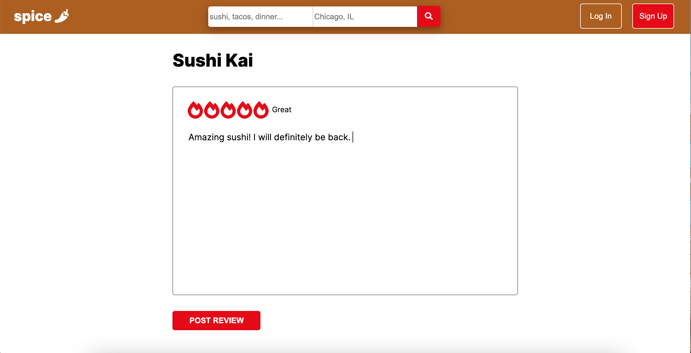

# Introduction

Link: [spice](https://spice-site.herokuapp.com/#/)

Welcome! spice is a Yelp clone with core features including: 
* User Authentication
* Search businesses by category
* Create, read, update, and delete reviews
* Business map


# Technologies Used

* React/Redux Frontend
* Rails backend
* PostgreSQL Database
* SCSS styling
* Google Maps JavaScript API
* AWS S3 for image storage

# Key Functionality

## User Authentication
Users can enter basic information to create an account on spice that will persist between sessions. Passwords are encrypted using the bcrypt hashing function. By logging in, users can access additional site functionality, such as writing reviews. A demo user is provided so a user can still have full access to the site without entering any personal information. 



*Note: Current database constraints only allow a user to leave one review per business. In other words, a user cannot review the same business twice. If logging in as the demo user, keep in mind that the demo user may have reviews already written for that business, so feel free to edit or delete these prior reviews to play around with functionality!*

## Search
Users can utilize a search bar to filter business results by category. Results are displayed on a results page with accompanying location through the integrated Google Maps API. At the time of writing, spice has businesses in the *Mexican, Japanese, Lunch, Dinner, Tacos, Sushi, and Ramen* categories. Results are limited to Chicago, IL for now. 



## Reviews
Logged-in users have the ability to write, edit, and delete reviews. Users can only edit and delete their own reviews, and a user can only review each business one time. Business ratings are calculated in real-time based on an average of all user ratings for that business. 



# Technical Implementation Snippets

## Backend Search
Searching/filtering is handled in the backend through a custom query method written in the `Business` model. This method is only called when a search parameter matches a business `Type` in the database. User inputs are also checked in the frontend to ensure the backend is receiving a legitimate business type. As a bonus, if a user searches with a blank input, all businesses will be fetched. To avoid N+1 queries, I make sure to include other relevant data such as `reviews`.

```ruby
# app/controllers/api/businesses_controller.rb

    def index 
        categories = [
                    'Mexican', 
                    'Tacos', 
                    'Sushi', 
                    'Japanese', 
                    'Ramen',
                    'Lunch',
                    'Dinner'
                    ]
        if params[:biz_type] == ""
            @businesses = Business.includes(:reviews, :types)
                            .with_attached_photos.all
            render :index
        elsif categories.include?(params[:biz_type][0].upcase + params[:biz_type][1..-1].downcase)
            @businesses = Business.includes(:reviews, :types)
                            .with_attached_photos.all
                            .by_type(params[:biz_type][0].upcase + params[:biz_type][1..-1].downcase) 
            render :index 
        end
                            
    end
```
```ruby
# app/models/business.rb

    def self.by_type(type)
        Business 
            .joins(:types)
            .where('types.biz_type LIKE ?', type)
    end
```

## Dynamic Review Form Star Ratings
This feature was fun to implement. When a user hovers over a star rating on the review form, all stars less than or equal to that star will change color, and the text next to the stars change depending on which rating is hovered over. There was also some additional logic pertaining to whether or not a user clicked a star. This involved tracking the current star (being hovered over) in state and re-rendering the text and the color of the appropriate stars. I used the React synthetic events `onMouseEnter` and `onMouseLeave`.

```javascript
// Excerpts from frontend/components/create_review_form.jsx

    constructor(props){
        super(props)
        this.state = {
            content: '',
            rating: '',
            user_id: this.props.userId,
            business_id: this.props.match.params.businessId,
            val: '0', // 'val' tells the component which stars to highlight and what value to assign upon form submit
            ratingClicked: false 
        }
        this.handleChange = this.handleChange.bind(this);
        this.handleSubmit = this.handleSubmit.bind(this);
        this.handleStarHover = this.handleStarHover.bind(this);
        this.handleStarLeave = this.handleStarLeave.bind(this);
    }

    handleStarHover(e){
        e.preventDefault();
        this.setState({val: e.currentTarget.value});
    }

    handleStarLeave(e){
        e.preventDefault();
        if (this.state.ratingClicked) {
            this.setState({val: this.state.rating});
        } else {
            this.setState({val: 0});
        }
    }

    // sample star input 

    <input 
        onMouseEnter={this.handleStarHover} 
        // if star is clicked, it will remain highlighted
        onMouseLeave={this.state.ratingClicked ? null : this.handleStarLeave} 
        onClick={this.handleChange('rating')} 
        type="radio" 
        value="1" 
        name="rating"
    /> 

    // Dynamically change color from grey to red
    <span className={this.state.val >= 1 ? 'red' : 'grey' }> 
        <FontAwesomeIcon key='1' icon={faFireAlt} />
    </span>

```

# Future Functionality
* Add more businesses to the database to expand seearch terms and filters.
* Add additional cities.
* Create User Profiles, so users can see all the reviews they've written.
* Add profile photos for users that will show up next to their reviews. 
